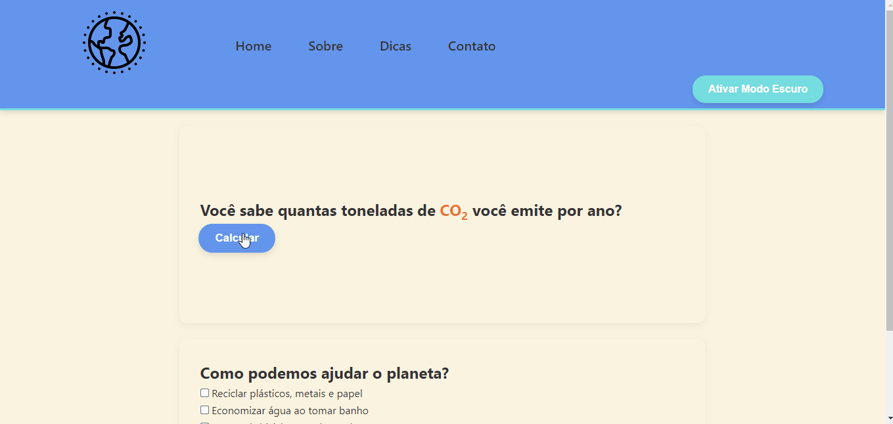

# 🌱 Projeto Sustentabilidade Ambiental

Este é o projeto de conclusão do Módulo 2 da Pda (Programadores do Amanhã), onde desenvolvemos um site no estilo Hackathon com foco em questões ambientais. O objetivo do projeto é educar e engajar os usuários em práticas sustentáveis.

## 📚 Índice

- [Descrição do Projeto](#descrição-do-projeto)
- [Tecnologias Utilizadas](#tecnologias-utilizadas)
- [Funcionalidades](#funcionalidades)

## 📝 Descrição do Projeto

O **Projeto Sustentabilidade Ambiental** visa sensibilizar os usuários sobre a importância da conservação ambiental e oferecer ferramentas práticas para a adoção de um estilo de vida mais sustentável.

## 🛠️ Tecnologias Utilizadas

- **HTML**: Estrutura básica do site.
- **CSS**: Estilização do layout e design.
- **JavaScript**: Interatividade do site.

## 🧰 Funcionalidades
### Calculadora de pegada de Carbono

### Modo Escuro

## 🎮 Acesse em: [BreadcrumbsProjetoM2-SustentabilidadeAmbiental](https://baagriel.github.io/ProjetoM2-SustentabilidadeAmbiental/)

